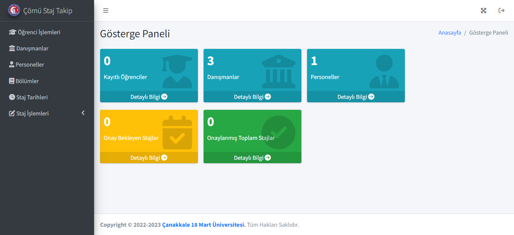
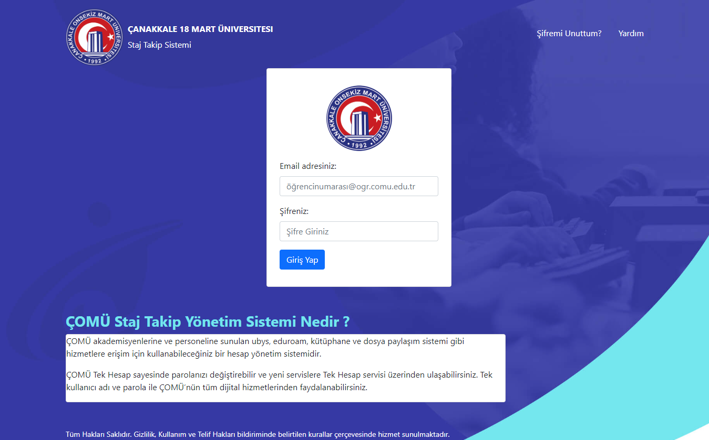
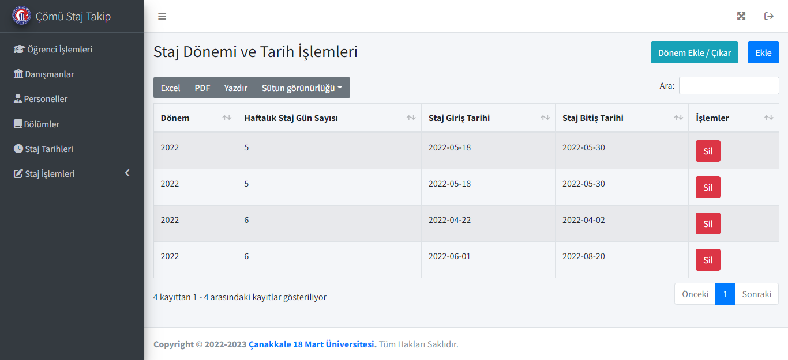
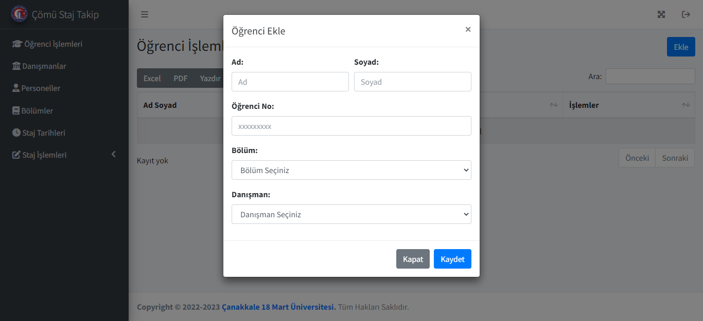

# Project Intern Management System using PHP/MySQL

## About This Project

The Intern Management System using PHP and MySQL can help a particular company manage the progress of their interns. The system has four system users: the Admin,Personel,Lecturer and the Intern.

Admin users can have a full control over the system. They have access to the whole list of interns. They will create a new user/intern, assign programs and tasks as well as their due dates and status. Admin users can also add, edit, or delete this information. Moreover, they can also modify the program list or status list. Intern users can only have access to their own data. They can edit their tasks' status, and personal information. Both Admin and Intern can use the filter and sort functions.

This application can also be used for similar purposes such as managing projects, students, etc.

## Features of Intern Management System

- Login Page
- Dashboard
- Programs (CRUD Features)
- Tasks (CRUD Features)
- Program Progress Bar
- User (CRUD Features)
- Admin Settings
- Filtering
- Sorting
  and Many More..

## Tools

- Name of Project: Intern Management System Project
- Language: PHP
- Databases used: MySQL
- Design used: HTML, CSS, JavaScript, JQuery, Bootstrap
- Software used: XAMPP

## Screenshots

_Login Page_

_Filtering and Sorting functions_

_Add-Edit-Read-Delete using Bootsrap Modals_

## How To Run

For preparation, please install a virtual server such as [XAMPP](https://www.apachefriends.org/) on your PC. After that, start Apache and MySQL in XAMPP. When you have done with XAMPP, follow the following steps:

Step 1: Download and extract this project's folder. 
Step 2: Copy the main project folder and padte in xampp/htdocs in your PC. 
Step 3: Open a browser and go to URL "http://localhost/phpmyadmin/". 
Step 4: Click on the databases tab. 
Step 5: Create a database naming "comu_staj" and then click on the import tab. 
Step 6: Click on browse file and select "comu_staj.sql" file which is inside the "database folder. 
Step 7: Click "Go" button. 
Step 9: Open a browser and go to URL "http://localhost/{folder_path}/" 

**Admin Access** 
Email: müdür@comu.edu.tr 
Password: müdür 
